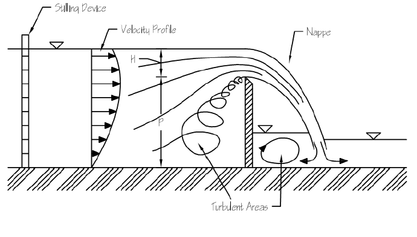
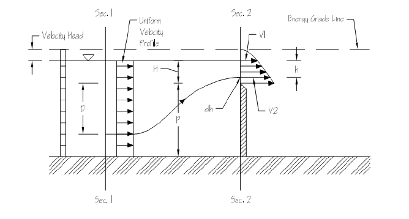

Open channel flow refers to the flow of a liquid with a free surface exposed to atmospheric pressure. Unlike flow through closed pipes, where pressure differences primarily drive the fluid, open channel flow occurs mainly under the influence of gravity.

Common examples of open channels include:

Rivers,
Irrigation canals,
Drainage systems,
Spillways,
Stormwater channels.

Accurate measurement of discharge in open channels is essential for the design and operation of hydraulic engineering systems. One of the simplest and most reliable methods of measuring discharge is by using a weir.

A weir is a vertical obstruction placed across an open channel that causes water to flow over a crest. The discharge through the channel can be determined by measuring the head of water above the crest.

Depending on the shape of the opening, sharp-crested weirs are commonly classified as:

Rectangular weirs,
Triangular (V-notch) weirs.

As water flows over the crest, it forms a free sheet of water known as the nappe. Proper ventilation beneath the nappe ensures atmospheric pressure exists below the flowing water and improves the accuracy of discharge measurements.

### Everyday Intuition

The principle of flow over a weir can be observed in many natural and engineering systems.

Water flowing over a small dam.
Irrigation canal regulators.
Overflow structures in reservoirs.
Stormwater drainage channels.

In each case, the amount of water flowing downstream depends on the height of water above the crest of the obstruction.

The Channels experiment demonstrates this relationship and shows how the discharge through an open channel can be determined by measuring the upstream water level.

### Experimental Relevance

The objective of the Channels experiment is to study the discharge characteristics of sharp-crested weirs installed in an open channel and to determine their coefficient of discharge.

The experiment involves:

Measuring the head of water above the weir crest,
Determining the actual discharge,
Calculating the theoretical discharge,
Evaluating the coefficient of discharge,
Comparing the behaviour of rectangular and triangular weirs.

The experiment demonstrates that the discharge over a weir depends on the geometry of the notch and the head of water above the crest.

### Mathematical Formulation

The flow over a weir is governed by the principles of conservation of mass and conservation of energy.

Bernoulli's theorem states that for steady, incompressible, and frictionless flow,

$$
\frac{P}{\rho g}
+
\frac{V^2}{2g}
+
Z
=

\text{Constant}.
$$

Where:

- $P$ = Pressure of the fluid, $\mathrm{N/m^2}$,
- $\rho$ = Density of the fluid, $\mathrm{kg/m^3}$,
- $V$ = Velocity of flow, $\mathrm{m/s}$,
- $g$ = Acceleration due to gravity, $\mathrm{m/s^2}$,
- $Z$ = Elevation above a reference datum, $\mathrm{m}$.

For the analysis of sharp-crested weirs, the following assumptions are made:

The upstream velocity distribution is uniform.
Streamlines over the crest are approximately horizontal.
Atmospheric pressure exists beneath the nappe.
Energy losses due to turbulence are neglected.
Surface tension effects are negligible.

#### Rectangular Weir

The theoretical discharge is

$$
Q_t=
\frac{2}{3}
L
\sqrt{2g}
H^{3/2},
$$

where

- $Q_t$ = Theoretical discharge,
- $L$ = Length of the weir crest,
- $H$ = Head of water above the crest.

#### Triangular (V-Notch) Weir

For a notch angle $\theta$,

$$
Q_t=
\frac{8}{15}
\tan\left(\frac{\theta}{2}\right)
\sqrt{2g}
H^{5/2}.
$$

Because of frictional and viscous effects, the actual discharge differs slightly from the theoretical value.

The coefficient of discharge is defined as

$$
C_d=
\frac{Q_a}{Q_t},
$$

where

- $Q_a$ = Actual discharge,
- $Q_t$ = Theoretical discharge.

<em>Figure 1: Flow over a sharp-crested weir showing the head over the crest and the nappe.</em>

### Application to the Channel Apparatus

The experimental setup consists of

An open channel,
Interchangeable rectangular and triangular sharp-crested weirs,
A point gauge for measuring the upstream head,
A measuring tank for determining the actual discharge.

Water is supplied to the channel at different flow rates and allowed to pass over the selected weir.

The upstream water level is measured using the point gauge to determine the head over the crest.

The actual discharge is determined by collecting water in the measuring tank over a known interval of time.

The theoretical discharge is calculated using the appropriate weir equation, and the coefficient of discharge is determined by comparing the actual and theoretical values.

<em>Figure 2: Experimental setup for determining the discharge through sharp-crested weirs in an open channel.</em>

The discharge characteristics are commonly studied by plotting discharge against the head over the crest.

For a rectangular weir,

$$
Q\propto H^{3/2},
$$

while for a triangular weir,

$$
Q\propto H^{5/2}.
$$

These relationships help verify the theoretical behaviour of flow over sharp-crested weirs.

### Engineering Significance

Sharp-crested weirs are widely used for measuring and regulating flow in open-channel systems.

Important applications include:

Irrigation canals,
River gauging stations,
Hydraulic laboratories,
Water treatment plants,
Stormwater drainage systems,
Reservoir outlet structures,
Environmental flow monitoring.

The Channels experiment demonstrates the practical application of open-channel flow principles and provides an understanding of how weirs can be used as reliable discharge-measuring structures. The determination of the coefficient of discharge is important for the calibration, design, and operation of hydraulic systems used in water resources engineering.
